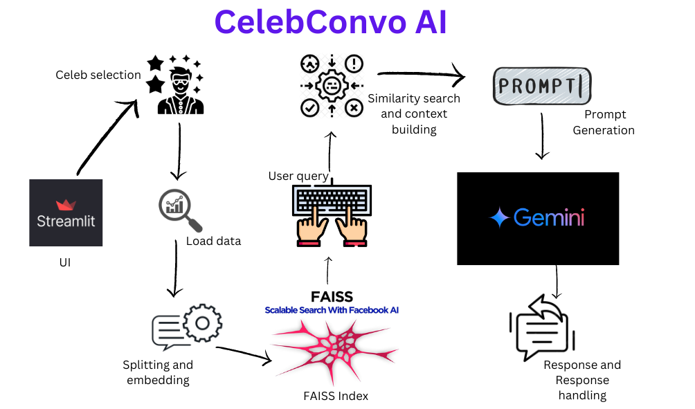

# CelebConvo AI

CelebConvo AI is an interactive chatbot application that allows users to have conversations with AI versions of their favorite celebrities. Powered by advanced natural language processing and machine learning models, CelebConvo AI provides engaging and entertaining interactions, making it feel like you're chatting with the real personalities.

## Features

- **Multi-Celebrity Support:** Chat with a variety of celebrities including:
  - Elon Musk
  - MS Dhoni
  - Mark Zuckerberg
  - Bill Gates
  - More celebrities can be easily added!
- **Dynamic Personality Responses:** Each celebrity has a unique style of response, mimicking their real-life personality and mannerisms.
- **Text Embedding and Similarity Search:** Uses state-of-the-art embedding models to provide contextually relevant answers.
- **Chat History Management:** Automatically saves chat history and context for seamless conversations.
- **User-Friendly Interface:** Clean and intuitive UI with images and styled chat bubbles for an enhanced user experience.

## Technologies Used

- **Streamlit:** For building the web application interface.
- **Transformers:** From Hugging Face for text embedding.
- **FAISS:** For efficient similarity search.
- **LangChain:** For managing prompt templates and LLM chains.
- **Google Generative AI:** For generating AI responses.
- **dotenv:** For managing environment variables.
- **PyTorch:** For handling model inference.

## Usage

1. Select a celebrity from the sidebar.
2. Ask any question in the text input box.
3. The AI will respond in the style of the selected celebrity.
4. The chat history is displayed with styled chat bubbles and celebrity images.

## Flow Diagram

## Contributing

I welcome contributions to enhance CelebConvo AI :) To contribute:

1. Fork the repository.
2. Create a new branch:
3. Commit your changes:
4. Push to the branch:
5. Open a Pull Request.
